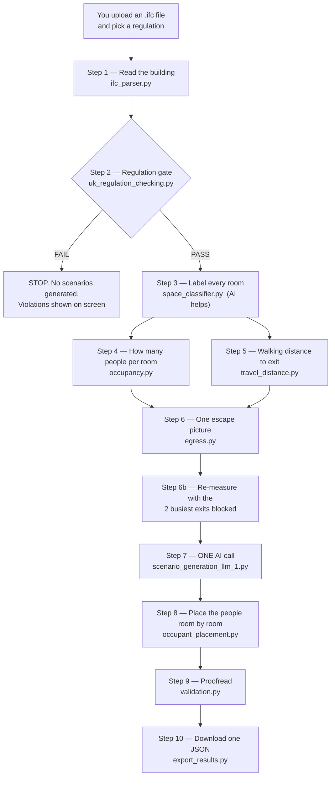

# How The Whole Project Works — Every Step, In Plain English

*A walkthrough of the NLP-Assisted Evacuation Scenario Generator: what it does, what happens in what
order, and which file does each job.*

---

## 1. The one-sentence version

You upload a **3D building model** (an IFC file, the kind an architect exports from Revit or
ArchiCAD). The program reads the building, checks it against fire-safety regulations, works out **how
many people are in each room** and **how far each room is from the nearest way out**, and then asks
an **AI** to invent a set of realistic "what if there's a fire" situations. The final answer is a
single **JSON file** that you can feed into a professional evacuation simulator (like Pathfinder) so
it can run the actual escape simulation.

**The key idea to hold on to:** the computer does the *maths*, the AI does the *judgement*. The AI is
never allowed to invent a number about the building. It only decides which scenarios are worth
testing, writes them up in English, and picks the simulator's settings.

---

## 2. An analogy before the detail

Imagine a fire-safety consultant preparing an evacuation study for a block of flats:

| The consultant does this… | …and in this project it's done by |
|---|---|
| Opens the architect's drawings and lists every room, door, stair and exit | `ifc_parser.py` |
| Checks the drawings against the building regulations — pass or fail | `uk_regulation_checking.py` |
| Labels each room ("this is a bedroom, that's a corridor") | `space_classifier.py` |
| Works out how many people each room holds | `occupancy.py` |
| Measures with a wheel how far you'd walk from the far corner of each room to the door out | `travel_distance.py` |
| Draws the escape-route map, room → door → stair → exit | `egress.py` |
| Thinks up the scenarios worth testing ("what if the main door is blocked?") and writes them up | `scenario_generation_llm_1.py` **(the AI part)** |
| Decides where each person stands when the alarm goes off | `occupant_placement.py` |
| Proofreads the whole report for mistakes | `validation.py` |
| Hands the client the deliverable | `export_results.py` |
| The desk they sit at and the buttons they press | `frontend/app.py` |

---

## 3. The map of the project

```
AI_Msc_project/
├── requirements.txt                     ← the list of Python libraries needed
├── evacuation_project/
│   ├── frontend/
│   │   ├── app.py                       ← THE WEB APP (start here — this is what you run)
│   │   └── uploads/                     ← IFC files you upload get saved here
│   ├── regulations_doc/                 ← the actual PDF of Approved Document B (reference only)
│   ├── output/                          ← saved example JSON outputs
│   └── core_backend/                    ← ALL THE ACTUAL WORK HAPPENS HERE
│       ├── ifc_parser.py                ← Step 1  read the building
│       ├── eng_reg.json                 ← the England rules, written as machine-readable data
│       ├── wales_reg.json  / scotland_reg.json / ireland_reg.json
│       ├── uk_regulation_checking.py    ← Step 2  the PASS/FAIL gate
│       ├── space_classifier.py          ← Step 3  what kind of room is this? (AI helps here)
│       ├── occupancy.py                 ← Step 4  how many people fit in it
│       ├── travel_distance.py           ← Step 5  how far is the walk to the exit
│       ├── egress.py                    ← Step 6  joins 4 + 5 into one escape picture
│       ├── llm.py                       ← the AI connection (Anthropic, or Mistral as backup)
│       ├── scenario_generation_llm_1.py   ← Step 7  THE AI CALL — the heart of the project
│       ├── occupant_placement.py        ← Step 8  put the people in the rooms
│       ├── scenario_schema.py           ← the rulebook describing what a valid output looks like
│       ├── validation.py                ← Step 9  proofreading / fact-checking
│       ├── export_results.py            ← Step 10 the final JSON deliverable
│       └── tests/                       ← automated tests that prove the above still works
```

> **Files ending in `_1.py` or `_test.py`** (`ifc_parser_1.py`, `scenario_llm_1.py`,
> `regulation_check_1.py`, `app_1.py`…) are **older drafts kept for the dissertation write-up**. They
> are not part of the live pipeline. The folder `core_backend/final_files/` is a frozen snapshot of an
> earlier working version. If you're tracing the real program, ignore both.

---

## 4. The workflow, end to end

Here's the whole thing at a glance, then we'll do each step slowly.



---

### Step 0 — You open the app

**File: `evacuation_project/frontend/app.py`** (built with Streamlit, a library that turns Python
into a web page).

You run it from the `evacuation_project` folder with:

```
streamlit run frontend/app.py
```

The page shows a sidebar with two things:

1. **Pick your regulation** — England, Wales, Northern Ireland or Scotland. Different countries in
   the UK have different fire-safety documents, and the project supports four.
2. **Upload an .ifc file** — the 3D building model. It gets saved into an `uploads/` folder.

You then press **Validate**. Nothing AI-related has happened yet.

The app also keeps a small "memory" of where you are (called *session state*): which file you
uploaded, whether it passed, and whether scenarios have been generated. This is what stops the
**Generate scenarios** button appearing before the building has passed the regulation check.

---

### Step 1 — Read the building

**File: `core_backend/ifc_parser.py`** · **Main function: `parser_summary(ifc_path)`**

An IFC file is a text file describing a building as a list of objects: `IfcSpace` (a room),
`IfcDoor`, `IfcStair`, `IfcWindow`, `IfcWall`, `IfcSlab` (a floor), `IfcBuildingStorey` (a floor
level), `IfcTransportElement` (a lift). It's an enormous, messy file — tens of megabytes of
engineering data.

This module opens it with a library called **ifcopenshell** and pulls out only what matters for
escaping a fire. It returns one big Python dictionary containing:

| What it extracts | Why it matters |
|---|---|
| **spaces** — every room, with its name, area, centre point, and its **footprint** (the actual outline shape of the floor) | These are the rooms people escape *from* |
| **doors** — with width, position, and whether the name/properties suggest it's an emergency exit | Doors are how you get from room to room |
| **door_space_links** — which doors touch which rooms | This is the "map" of what connects to what |
| **stairs** and **stair_flights** — with rise, going and slope | How you get between floors |
| **storeys** — each floor level and its height above the ground | Tells us which floor is the ground floor |
| **windows, walls, slabs, smoke alarms, lifts** | Needed for the regulation checks |
| **emergency_exits** | Doors that lead outside — the finish line |

**Three real problems it solves along the way** (these were the hard-won bits):

1. **Units.** Some IFC files are in millimetres, some in metres. Everything is scaled to **metres**
   once, at the start, so nothing downstream has to worry about it.

2. **Room area.** It first looks for an area written into the file as a property. If there isn't
   one, it *calculates* it from the room's 3D shape (`get_footprint_area`).

3. **Broken room placements (`reconcile_space_frame`).** This is the clever one. Some exporters lose
   the position information on rooms, so the rooms end up drawn in a completely different place from
   the doors and walls — rotated and shifted. If that isn't fixed, **no door touches any room** and
   every escape route vanishes. The fix: the door↔room connections are known from the file's own
   topology (which doesn't depend on coordinates at all), so the program uses those pairings to
   *solve* for the rotation and shift that puts the rooms back where they belong. It sweeps every
   possible rotation angle, then refines with an algorithm called ICP. Crucially it only accepts the
   correction if it **measurably improves** how well doors line up with their rooms — so a clean model
   is left completely untouched. (The test model
   `ARK_NordicLCA_Housing_Concrete_As-Built_Revit-IFC4X3.ifc` is rotated by −60.6° by this defect;
   its `BuildingPermit` twin is clean, and the pair is used as the regression test.)

---

### Step 2 — The regulation gate (the PASS/FAIL blocker)

**File: `core_backend/uk_regulation_checking.py`** · **Main function: `regulation_gate(summary,
jurisdiction)`**
**Data files: `eng_reg.json`, `wales_reg.json`, `scotland_reg.json`, `ireland_reg.json`**

The four `*_reg.json` files are the fire-safety documents rewritten as data a computer can check.
Each rule looks like this:

```json
{
  "unique_id": "ENG-R1",
  "regulation_name": "The minimum door width required for the escape route plan",
  "ifc_element": "IfcDoor",
  "ifc_attribute_involved": "OverallWidth",
  "comparison": "gte",          ← "greater than or equal to"
  "threshold_mark": 750,
  "unit": "mm",
  "severity_level": "critical",
  "doc_reference": "Section 3, Paragraph 3.94 and 3.95"
}
```

The checker walks through every rule for the chosen country and compares it against what the parser
found — door widths, stair widths, window sizes and sill heights, lift provision, floor fire ratings,
smoke alarm coverage, and so on. Each finding lands in one of **two buckets**:

* **Violations** — a number that is measurably wrong (e.g. a 600 mm door where 750 mm is required).
  These are **blocking**. One violation and the building fails.
* **Manual review** — things the IFC simply cannot answer (e.g. "does this floor slab have a
  60-minute fire rating?" when no fire rating is recorded anywhere in the file). These are shown on
  screen for honesty but **do not block**, because almost every real model is missing this kind of
  data and blocking on it would fail everything.

**Why this step exists:** it's a deliberate design decision. The AI is *never* asked to judge
compliance. Compliance is a deterministic, auditable comparison of numbers against a document, done
before the AI is even contacted. If the building fails, the app stops dead — you get a red FAIL
banner and a table of violations, and the **Generate scenarios** button never appears.

---

### Step 3 — What kind of room is this?

**File: `core_backend/space_classifier.py`** · **Main function: `classify_spaces(spaces)`**

A room in an IFC file might be named `"3H+K+S"`, `"Makuuhuone"`, `"Trapperom"`, `"GFA"`, or nothing
at all. Before you can say how many people are in it, you have to know **what it is**. Everything is
mapped onto a fixed list of 17 use-types: `bedroom, living, kitchen, kitchen_living, dining,
dwelling, circulation, stair, sanitary, sauna, storage, plant, parking, communal_amenity, commercial,
measurement_zone, unknown`.

This happens in **two passes**:

**Pass 1 — the dictionary (free, instant, deterministic).** A keyword list, deliberately
multilingual because the test models are Nordic:

* `"stair", "trapp", "porras"` → stair
* `"bedroom", "soverom", "makuuhuone"` → bedroom
* `"wc", "kylpyhuone", "bathroom"` → sanitary
* `"gfa", "gross floor", "bruttoareal"` → **measurement_zone**

That last one matters: BIM models often contain invisible "rooms" that are really just area
measurement overlays sitting on top of the real rooms. If you counted them as rooms you'd
double-count the whole building. They're detected here and thrown out later in Step 6.

There's also a pattern for Finnish apartment notation — `3H` means "3 habitable rooms" — which marks
the space as a whole **dwelling** (a flat), not a single room. And if the name gives nothing, it
falls back to the IFC's `OccupancyType` code (`0121-92` → stair, `0121-64` → kitchen, etc.).

**Pass 2 — the AI, only for the leftovers.** Any room the dictionary couldn't resolve is sent to the
language model in **one batch call**, with its name, area and storey, and asked to pick one use-type
from the same fixed list. Two cost-saving touches: identical room names are **de-duplicated** first
(50 rooms called "Varasto" become one question), and the whole call is skipped entirely if the
dictionary resolved everything.

Every room comes out carrying **where its label came from** — `dictionary`, `occupancy_code` or
`llm` — plus a confidence score, so you can always see which labels the AI touched.

> This step alone cut the unresolvable rooms on the Nordic test model from 68 down to 6.

---

### Step 4 — How many people are in each room?

**File: `core_backend/occupancy.py`** · **Main function: `occupant_load(space, use_type)`**

**No AI here.** This is straight arithmetic out of the published guidance.

Fire-safety documents give a **floor space factor**: how many square metres of a given room type each
person needs. Divide the room's area by that factor and you get the design occupancy.

| Room type | m² per person | Code category |
|---|---|---|
| dining | 1.0 | dining room / restaurant |
| living / communal_amenity | 1.0 | lounge / common room |
| commercial | 6.0 | office |
| kitchen | 7.0 | kitchen |
| bedroom | 8.0 | bedroom |
| storage / parking | 30.0 | storage / car park |

So a 24 m² office → `24 / 6 = 4 people`. The result is always rounded **up**, minimum 1.

**Three special rules, each of which is a real design decision:**

1. **Corridors, stairs, toilets and plant rooms get zero.** The guidance is explicit: you don't count
   people as *living* in a corridor, because they're already counted in the room they came from.
   Note the difference between a **0** and a **not assessed** — 0 means "correctly zero", not
   "we don't know".

2. **Storage and car parks are NOT zero.** They get a sparse 30 m²/person. Easy to get wrong.

3. **Homes don't work this way at all.** You don't count a flat's bedroom by floor area. So for a
   **dwelling**, occupancy = *habitable rooms + 1* (a 3-room flat ≈ 4 people), which lines up with
   the Nationally Described Space Standard's "2b4p / 3b5p" bedspace notation. And on a floor made of
   apartments, the individual bedrooms/kitchens inside them are set to **0** — because the IFC models
   them as siblings of the apartment, not children, so counting both would double-count every
   resident.

Every single number carries an **`occupant_basis`** string explaining exactly how it was derived,
e.g. `"commercial: 47.3 m2 / 6 m2/person (office) = 8 persons"`. Nothing is unexplained.

If a room can't be assessed (unknown type, or no area recorded), it does **not** silently become
zero — it's added to a list called **`not_assessed`** and shown on screen. *Never silently pass an
unknown as safe* is a rule the whole project follows.

---

### Step 5 — How far do you actually have to walk?

**File: `core_backend/travel_distance.py`** · **Main function: `compute_travel_distances(...)`**

**Also no AI.** This is the most computationally interesting module in the project.

The naive way to measure "how far is it to the exit" is a straight line from the middle of the room.
That's wrong twice over: people can't walk through walls, and the person in danger is the one in the
**far corner**, not the middle.

So this module measures the **real walked path**:

1. **Build the walkable floor.** Take each room's footprint outline and shrink it inward by 15 cm
   (`body_clearance_m`) — your shoulders don't scrape the wall, and more importantly the shrinking
   creates a **gap between neighbouring rooms** so they don't merge through the shared wall. Then
   drop a small disc at every door position to **bridge** those gaps. Result: you can only get from
   room to room **through a door**, exactly like real life.

2. **Turn it into a grid.** The walkable area is rasterised into **10 cm × 10 cm cells**
   (`CELL_M = 0.1`), each connected to its 8 neighbours — a giant graph of walkable squares.

3. **Flood outward from the exits.** A multi-source **Dijkstra** (shortest-path algorithm, run with
   scipy) starts at every final exit at once and spreads through the grid, so every cell learns its
   true walking distance to the nearest exit — around walls, through doorways.

4. **Take the worst cell in each room.** A room's travel distance is the **maximum** over its cells —
   the **most remote point**. That's the person who has the furthest to go.

**Multi-storey buildings** are handled by chaining: the ground floor is measured first, seeded at the
real exits. Then each upper floor is seeded at its **stair doors**, with each seed pre-loaded with a
head start cost = *(the walk down the stairs)* + *(the distance from the bottom of that stair to a
real exit on the ground floor)*. The stair descent isn't guessed — it's derived from the actual flight
geometry (`slope ÷ rise`). One Dijkstra pass then gives every room on that floor its true
whole-building distance.

There's also a repair for a common IFC defect: a door's recorded point often isn't on the centreline
of the wall, so the little disc misses one of the rooms it's supposed to connect. Where the gap is
small enough to be placement sloppiness, a **connector** is run from the door out to the room — but
it's **refused if it would cross a third room**, so this can never tunnel a fake shortcut through
somebody's living room.

> This engine replaced the old centre-to-centre method and took the reachable rooms on the Nordic
> model from 76/130 to **122/130**, and the unassessed rooms down to 1.

---

### Step 6 — Put it together into one escape picture

**File: `core_backend/egress.py`** · **Main function: `ground_spaces(summary, classified)`**

This is the join point. It builds a **connectivity graph** of the whole building:

* Each **room** is a node.
* A **door** between two rooms makes them neighbours.
* **Stair rooms stacked above each other** (within 4 m vertically and 12 m horizontally) are joined,
  so you can walk between floors.
* A door that is an emergency exit **and sits at ground level** becomes a special `EXIT` node
  connected to `OUTSIDE`. (Only ground level — an "emergency exit" door on the third floor doesn't
  lead outside.)

Then for every room it records:

* its **occupant load** (from Step 4),
* its **travel distance** (from Step 5),
* its **nearest exit** (found by walking the graph outward with a breadth-first search),
* whether it's **reachable** at all.

Two robustness details worth knowing:

* **The fallback.** If the geodesic grid engine fails on a room (broken geometry) but the graph says
  there *is* a door route out, the room is kept with an approximate distance and the method is
  labelled `"fallback_centroid (geodesic grid disconnected)"`. A geometry defect must never read as
  "there's no way out of this room" when the doors say otherwise.
* **Reproducibility.** Neighbours are visited in **sorted order**, not the order Python happens to
  hash them in. Without this, two equally-distant exits would tie-break differently on different runs
  and the same file could report a different nearest exit each time.

Anything that can't be resolved goes into **`not_assessed`** with a reason and the note
`"flagged, not silently passed"`.

**Step 6b — the degraded cases.** Before calling the AI, `scenario_generation_llm_1.py` finds the
**two busiest exits** (the ones the most rooms rely on) and runs the *entire* Step 5 + Step 6
computation again with each one removed. So when the AI later writes a scenario about the main exit
being blocked, there are **real recomputed numbers** to cite instead of invented ones. Two variants
is a deliberate limit — each one is a full raster + Dijkstra pass per storey, so it's expensive.

---

### Step 7 — The AI call (the heart of the project)

**File: `core_backend/scenario_generation_llm_1.py`** · **Main function:
`generate_scenario_object(...)`** · **AI connection: `core_backend/llm.py`**

Everything above was preparation. Now, in **one single API call**, the AI is asked to do the one job
a computer genuinely can't: **decide which evacuation situations are worth testing in this specific
building, and explain them.**

**What the AI is shown** (the "facts block") — a plain-text briefing containing:

* the building totals: storeys, floor area, total occupant load;
* every storey with its elevation;
* every final exit, by ID and width;
* every stair;
* a per-storey rollup: occupants, room count, longest travel distance, unreachable rooms;
* the 8 longest travel distances in the building;
* **every single room**: GUID, use-type, storey, area, occupants, travel distance, nearest exit;
* the **degraded-case numbers** from Step 6b;
* the list of **regulation references** it's allowed to cite;
* a note of how many rooms couldn't be assessed.

**What the AI is forbidden to do** — the system prompt is blunt about it:

> *"IMPORTANT — the numbers are already done… Use them exactly as supplied. Never recompute,
> re-estimate, scale or round them differently, and never invent an occupant count, a distance, a
> room or an exit. Every number in your prose must appear verbatim in the facts below."*

**What the AI must produce** — at least **four** scenarios. The first is always the **Base Case**
(all exits open, normal occupancy). The rest it must choose *itself* by analysing this building:
loss of the busiest exit, night occupancy, an upper-floor route lost, congestion at a stair —
whatever the geometry suggests. The prompt is explicit that they must **not be chosen at random**.

For each scenario it writes:

| Field | What it is |
|---|---|
| `type`, `title` | e.g. `one_exit_discounted`, "Main entrance blocked at night" |
| `conditions` | which exits stay open, which are closed, occupancy state, how many people |
| `occupant_distribution` | people per storey/area |
| `routes` | from → via → to_exit |
| `bottlenecks`, `risks`, `assumptions` | the engineering commentary |
| `narrative` | a plain-English paragraph a non-engineer can read |
| `regulatory_justification` | which regulation clause this tests — **only from the supplied list** |
| `ai_explanation` | why it chose this scenario |
| **`simulation`** | **the one place the AI originates numbers** — see below |

**The `simulation` block — the AI's own numbers, and the only ones.** The occupant loads and travel
distances are off-limits, but the *simulator settings* are genuinely the AI's engineering judgement:

* **movement_model** — `steering` (agent-based, shows queueing) or `sfpe` (hydraulic flow);
* **end_time_s** — how long to let the simulation run;
* **pre_movement** — how long people take to *react* before moving, as a full distribution
  (mean + standard deviation), because a sleeping resident reacts far slower than an alert office
  worker;
* **profiles** — the population mix (adults / children / reduced mobility), each with a walking speed
  and shoulder width; the fractions must sum to exactly 1.0;
* **occupancy_multipliers** — how a "night" scenario got from the full occupant load down to its
  number, per room type (e.g. commercial → 0.0, dwelling → 1.0).

Every one of these carries a **`basis`** field where the AI must state its reasoning. And there's a
**hard cap of 1.0 on every multiplier** — the AI can *empty* a room type but never *overfill* it,
because the computed occupant load is already the room's code-derived capacity. To make a scenario
harder the AI must close an exit or slow the population down, never inflate the crowd.

**How the reply is forced into shape.** The whole expected answer is defined as **pydantic models**
(`ScenarioContent`, `SimulationSetup`, `OccupantProfile`…) and passed to LangChain's
`with_structured_output()`. The AI can't reply with prose — it must return data matching that shape,
or it's rejected.

**And if it's rejected?** `invoke_structured()` retries up to **3 times**, and each retry **hands
the model its own validation error** and tells it to clamp the offending field to the nearest allowed
value. This exists because of a real failure: a model reaching for a "crowded building" scenario kept
setting an occupancy multiplier above 1.0, which the schema forbids — and one bad field was throwing
away a 16,000-token, 10-minute call. The constraints themselves are **never relaxed**; a reply that
keeps breaking them still fails. This is exactly the retry loop tested by
`tests/test_generation_retry.py`.

**Which AI?** `llm.py` picks **Anthropic** if `ANTHROPIC_API_KEY` is set in your `.env`, otherwise
falls back to **Mistral**. Temperature defaults to 0 (as deterministic as an LLM gets). The generation
call gets a big budget — 16,384 tokens and a 600-second read timeout — because it's producing a large
structured answer in one shot, and the default 120 s timeout was causing retry storms.

**What comes out:** the AI's scenarios are wrapped in a large object assembled **deterministically**
around them — `building`, `exits`, `doors`, `circulation` (stairs), `stair_links`, `elevators`,
`spaces`, `degraded_cases`, `regulation_check`, `not_assessed`, and a **`provenance`** block recording
which model generated it, when, which occupancy factors were used and by which method distances were
measured. The scenario IDs (`SCN-001`, `SCN-002`…) are assigned **here, not by the AI**, so they can
never collide or be styled differently.

---

### Step 8 — Put the people in the rooms

**File: `core_backend/occupant_placement.py`** · **Main function: `attach_occupancy(obj)`**

The AI said "this scenario evacuates 62 people at night". A simulator can't use that — it needs to
know **which room each person starts in**. That's this module, and it's fully deterministic:

1. Start from each room's **computed** occupant load.
2. Scale it by the scenario's **per-use-type multipliers** (rooms multiplied by 0 drop out entirely).
3. Cap the total at what those remaining rooms can actually hold.
4. Spread the people using **largest-remainder rounding**, so the split adds up to the target
   **exactly** — nobody is invented and nobody is lost.
5. Give each room a **goal**: `goto_<exit-id>` for its computed nearest exit — unless *this scenario
   closes that exit*, in which case it falls back to the generic `goto_nearest_available_exit` and the
   output reports how many rooms had to be rerouted.
6. Assign each person a **profile** (adult / child / reduced mobility) from the AI's mix — and the
   sequence is **interleaved**, not grouped, so the reduced-mobility occupants don't all end up parked
   in the last few rooms.

**Two things it deliberately refuses to do**, both because they'd amount to inventing a building that
doesn't exist:

* People in rooms with **no traced escape route** are reported as **`unplaced`** — they are *not*
  quietly moved into rooms that can escape.
* If the AI asks for more people than its own multipliers leave room for, the remaining rooms are
  **not** scaled up. The shortfall is reported as **`unallocated`**. (This came from a real bug: a
  night scenario asking for 50 against a multiplied capacity of 35 put **4 people in a 3-person
  sauna**.)

The guarantee is: `placed + unplaced + unallocated = occupants_total`. Always.

---

### Step 9 — Proofread everything

**File: `core_backend/validation.py`** · **Main function: `validate(obj)`**
**Rulebook: `core_backend/scenario_schema.py`**

Before anything is shown or downloaded, the whole object is checked four ways:

**1. Schema check.** `scenario_schema.py` is a formal **JSON Schema** describing exactly what a valid
output looks like — every required field, every type. Checked with the `jsonschema` library.

**2. Invariants** — things that must be true or something has gone wrong:

* every occupiable room is either reachable **or** explicitly flagged in `not_assessed`;
* there are at least 2 scenarios;
* the room-by-room occupant loads add up to the stated building total;
* the total occupants fit within the exit capacity (width × 200 persons per metre);
* no negative travel distances;
* simulation parameters are in range;
* every occupant is placed and has a goal.

**3. The number fact-check** — this is the anti-hallucination guard, and it's the most important one.
It gathers **every number that appears anywhere in the AI's prose** (narrative, titles, bottlenecks,
risks, routes, assumptions) and checks each one traces back to a computed value in the record. Small
counting numbers (≤ 12) are allowed, and there's a 5% tolerance. Anything else that can't be traced is
listed in **`ungrounded_numbers`** and flagged on screen as "numbers to review". The AI's *own*
simulation parameters and the degraded-case figures are added to the allowed set — otherwise every
scenario would be flagged for quoting its own pre-movement time.

**4. Range checks on the AI's own numbers.** The simulation block is the one place fact-checking
can't apply, so it's range-checked instead against deliberately **wide** physical envelopes — walking
speed 0.5–2.0 m/s, shoulder width 0.30–0.70 m, pre-movement 0–1800 s — plus the rules that profile
fractions must sum to 1.0 and every value must carry a written basis. These exist to catch a value
that isn't *physically sensible*, not to second-guess the engineering.

The placement check is **recomputed from scratch** rather than read from the stored block — that's
what makes it a check, and it also catches a JSON that's been hand-edited.

---

### Step 10 — The deliverable

**File: `core_backend/export_results.py`** · **Main function: `build_records(obj)`**

The final answer is **one JSON file**, and it's an array of records — **one per scenario** — each with
exactly six fields:

| Field | Contents |
|---|---|
| `unique_id` | `SCN-001`, `SCN-002`, … |
| `description` | the scenario title |
| `relevant_ifc_element` | **every** door, stair and lift the scenario runs over, each tagged `open` or `closed` for *this* scenario |
| `regulatory_justification` | the regulation clause being tested |
| `ai_explanation` | why this scenario was chosen |
| `scenario` | conditions, simulation settings, occupancy, occupant distribution, assumptions, routes, bottlenecks, risks |

**Why is there no geometry in it?** Because the simulator imports the **same IFC file** for the
geometry. Every element in the record is keyed on its **IFC GlobalId**, in **metres**, in **IFC world
coordinates** — so the two line up perfectly with nothing to re-project. The record supplies precisely
what the IFC *cannot*: which exits are open, how many people are evacuating and in what occupancy
state, where each of them starts, and what profiles and pre-movement times to run them with.

That split — **IFC carries the geometry, this JSON carries the people and the conditions** — is the
whole design of the deliverable. There is deliberately **no CSV**; a test enforces that the deliverable
stays a single JSON.

The full building object (spaces, per-room placement, benchmark distances, the regulation gate,
provenance) stays available in the app as a reference expander, but it isn't the deliverable.

---

## 5. What the screen shows you

Reading `app.py` top to bottom, the output page gives you:

1. **Step 1 verdict** — a green PASS or red FAIL banner, with a table of violations and a collapsible
   list of manual-review items.
2. **Three validation badges** — Schema valid · Invariants passed · Number fact-check passed.
3. **Building metrics** — storeys, total occupant load, total floor area, number of final exits,
   number of spaces.
4. **Not assessed** — expanded by default whenever there's anything in it. Deliberately in your face.
5. **A radio selector for the scenarios** — pick SCN-001, SCN-002…
6. Per scenario: occupancy state, occupants, exits open/closed, the **narrative**, the AI's
   explanation, the regulatory justification, occupant distribution, assumptions, bottlenecks, risks
   and a routes table.
7. **Simulation set-up** — labelled on screen as *"the only AI-chosen numbers in the output, each with
   a basis"*.
8. **Occupant placement** — placed vs total, rooms seeded, unplaced, unallocated, and the full
   per-room table with seed points and goals.
9. **Export** — a JSON preview and a **Download JSON** button.

---

## 6. Who decides what — the honest summary

This is the question an examiner will ask, so here it is in one table:

| Decision | Made by | Where |
|---|---|---|
| What's in the building (rooms, doors, stairs, exits) | **The IFC file**, read deterministically | `ifc_parser.py` |
| Does it pass the regulations | **Deterministic threshold checks** against a rules JSON | `uk_regulation_checking.py` |
| What type of room is this | **Dictionary first**, AI only for leftovers | `space_classifier.py` |
| How many people in each room | **Published code floor-space factors** — arithmetic | `occupancy.py` |
| How far to the exit | **Measured geodesically over the real floor plan** | `travel_distance.py` |
| Nearest exit / reachability | **Graph search** over door and stair connections | `egress.py` |
| **Which scenarios are worth testing** | **The AI** | `scenario_generation_llm_1.py` |
| **The English write-up, routes, bottlenecks, risks** | **The AI** (numbers must be quoted, not invented) | `scenario_generation_llm_1.py` |
| **Simulator settings — speeds, pre-movement, profiles** | **The AI** (range-checked, must state a basis) | `scenario_generation_llm_1.py` |
| Which room each person starts in | **Deterministic allocation** | `occupant_placement.py` |
| Is the output trustworthy | **Schema + invariants + number fact-check** | `validation.py` |

**One AI call for classification** (skipped if the dictionary handles everything) **and one AI call
for generation.** That's it. Everything else is computed.

---

## 7. The safety nets, and why each exists

| Net | What it prevents |
|---|---|
| **The regulation gate** | The AI writing an evacuation study for a building that's already non-compliant |
| **`not_assessed`** | A room with missing data quietly reading as "safe" |
| **The number fact-check** | The AI hallucinating a travel distance or an occupant count |
| **Multiplier capped at 1.0** | Scenarios stuffing more people into a room than the code allows |
| **`unplaced` / `unallocated`** | Silently redistributing people into rooms that can escape, hiding a real problem |
| **Schema + retry loop** | One malformed field destroying an expensive generation call |
| **Frame reconciliation gated on measurable improvement** | "Fixing" a model that was never broken |
| **Connectors refused across a third room** | Inventing a shortcut through somebody's living room |
| **Sorted graph traversal** | The same file giving different answers on different runs |
| **Everything carries a `basis` / `method` / `source`** | Any number in the output being unexplainable |

---

## 8. The tests

In `core_backend/tests/`, run with `pytest`:

| Test file | What it proves |
|---|---|
| `test_ifc_parser_frame.py` | The rotated As-Built model gets corrected, and the clean twin is left alone |
| `test_travel_distance.py` | The geodesic engine returns known answers on known shapes |
| `test_egress_known_answer.py` | Connectivity and nearest-exit are correct on a hand-checked layout |
| `test_occupant_placement.py` | The allocation conserves people and never overfills a room |
| `test_validation_factcheck.py` | An invented number in the narrative is actually caught |
| `test_generation_retry.py` | A schema-rejected reply is retried with the error fed back |
| `test_export_records.py` | The deliverable has the right six fields — **and stays a single JSON** |
| `test_regulation_gate.py` | Violations block, manual-review items don't |
| `test_classifier_eval.py` | The classifier is scored against `labelled_spaces.json` |

---

## 9. How to run it yourself

**One-time setup**

```
pip install -r requirements.txt
```

Create a `.env` file in the project with your AI key:

```
ANTHROPIC_API_KEY=sk-...
ANTHROPIC_MODEL=claude-...
```

(or `MISTRAL_API_KEY` + `MISTRAL_MODEL` instead — `llm.py` prefers Anthropic and falls back to
Mistral.)

**The app**

```
cd evacuation_project
streamlit run frontend/app.py
```

**Any single stage on its own** — every module has a `__main__` block, so you can test the pipeline
piece by piece without the UI. Run from the `evacuation_project` folder:

```
python -m core_backend.ifc_parser            path/to/model.ifc   # what's in the building
python -m core_backend.uk_regulation_checking path/to/model.ifc  # PASS/FAIL, all four jurisdictions
python -m core_backend.space_classifier      path/to/model.ifc llm
python -m core_backend.egress                path/to/model.ifc   # occupancy + distances
python -m core_backend.scenario_generation_llm_1 path/to/model.ifc # the full AI generation
python -m core_backend.validation            saved_object.json   # re-validate, no API cost
python -m core_backend.export_results        saved_object.json   # re-export, no API cost
```

The last two are worth knowing: the generation modules **save the generated object to your TEMP
folder**, so you can re-run validation and export against that saved file for free instead of paying
for another AI call.

**Useful environment variables**

| Variable | Default | Effect |
|---|---|---|
| `EVAC_DISCOUNT_VARIANTS` | 2 | How many "busiest exit blocked" recomputations to precompute |
| `EVAC_GEN_ATTEMPTS` | 3 | Retries when the AI's reply fails the schema |
| `EVAC_GEN_TIMEOUT` | 600 s | Read timeout for the big generation call |
| `EVAC_SAMPLE_IFC` | — | A default IFC path for the command-line demos |
| `ANTHROPIC_TEMPERATURE` | 0 | Higher = more varied scenarios, less repeatable |

---

## 10. Glossary

* **IFC** — Industry Foundation Classes. The open, vendor-neutral file format for 3D building models.
  An architect exports it from Revit or ArchiCAD.
* **BIM** — Building Information Modelling. The general practice; IFC is the exchange format.
* **GlobalId / GUID** — the unique ID every object in an IFC file carries. It's how this project's
  output and the simulator's geometry stay pointed at the same door.
* **IfcSpace** — a room. **IfcBuildingStorey** — a floor level.
* **Occupant load** — the design number of people a room is assumed to hold.
* **Floor space factor** — m² per person for a given room type, from the fire-safety guidance.
* **Travel distance** — the walked distance from the most remote point of a room to the nearest exit.
* **Final exit** — a door that leads outside, at ground level. The finish line.
* **Discounted exit** — an exit assumed blocked in a scenario, so you have to check the building still
  works without it. This is standard fire-engineering practice.
* **Pre-movement time** — how long people take to react before they start moving. Often the single
  biggest factor in total evacuation time.
* **Geodesic distance** — the shortest path *within* a shape, going around obstacles — as opposed to a
  straight line through walls.
* **Dijkstra** — the classic shortest-path algorithm.
* **LLM** — Large Language Model. The AI.
* **Pathfinder** — the commercial egress simulator this project's JSON is designed to feed.
* **Approved Document B** — the England/Wales fire-safety guidance document. Scotland has the
  Technical Handbooks; Northern Ireland has Technical Booklet E.

---

## 11. The whole thing in six sentences

You upload a 3D building model and pick a country's fire regulations. The program reads every room,
door, stair and exit out of that model, fixing broken coordinates where the exporter mangled them,
then checks the building against the regulations and **stops dead** if it fails. If it passes, it
labels every room, calculates how many people each holds from the published floor-space factors, and
measures the real walked distance from each room's furthest corner to the nearest exit by flooding a
10 cm grid of the actual floor plan. All of that is handed to an AI as **facts it must not change**,
and in one call the AI decides which four-or-more evacuation scenarios are worth testing in this
particular building and writes them up — including the simulator settings, which are the only numbers
it's allowed to originate. The program then places every occupant room by room, fact-checks every
number in the AI's prose against the computed record, and exports one JSON that a professional egress
simulator can run alongside the original IFC. Anything it couldn't work out is listed openly rather
than assumed safe.
