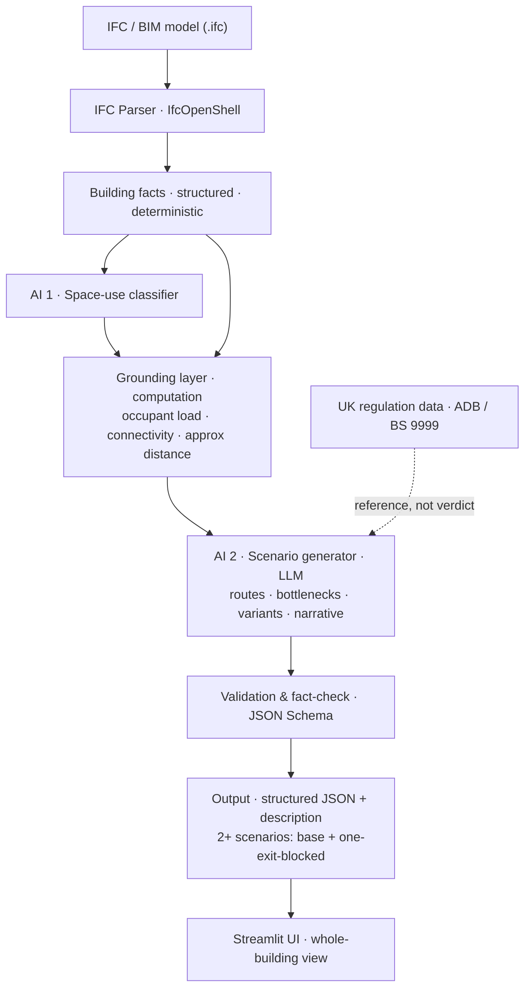

# Plan — AI Evacuation Scenario Generator

> End-to-end plan for pivoting the project from a **per-violation compliance checker** to an
> **AI-driven whole-building evacuation *scenario* generator** driven by an IFC/BIM model.
> Companion design reference (diagram + worked JSON output) lives in Notion:
> *Evacuation Scenario Generator — Architecture & Final Output*.

---

## 1. Context & background

### 1.1 Where we started
The existing system (`core_backend/`) does three things:

1. **`ifc_parser.py`** — parses an IFC/BIM model with IfcOpenShell into a structured `summary`
   dict (spaces, doors, stairs, windows, walls, slabs, storeys, alarms, connectivity, positions).
2. **`uk_regulation_checking.py`** — compares each element attribute against hardcoded thresholds in
   the jurisdiction JSON files (England/Wales/NI/Scotland) and emits a flat list of **violation flags**.
3. **`scenario_generation_llm_1.py`** — for **each flag**, an LLM writes a 3-sentence explanation.

### 1.2 The problem (why we are pivoting)
What the old system calls a "scenario" is really **one code violation per record** (confirmed by
`export_results.py`, whose `scenarios[]` is a flat list keyed on element GUID + regulation id). It
never assembles the whole structure; the building appears only as summary counts. That is a
**compliance checker mislabelled as a scenario generator** — which is exactly the feedback received.

### 1.3 What "evacuation scenario" actually means
An evacuation scenario is the **input** step of fire-safety egress analysis — a structured,
self-consistent, whole-building description of how the structure would be evacuated under one credible
set of conditions. It is **not** a simulation (no evacuation-time computation, no RSET/ASET, no smoke
modelling). This project **generates the scenario and stops there.**

### 1.4 Supervisor's bar
> *"As long as you can use AI to generate evacuation scenarios for the building that you uploaded,
> it is a big improvement."*

This is an **MSc data-science project**, so AI/LLM must be an **integral, justified** part of scenario
generation — neither token AI ("used it because I had to") nor an over-engineered graph-theory pipeline.

---

## 2. Objective & success criteria

**Objective:** From an uploaded IFC model, automatically generate **≥2 structured evacuation
scenarios** (as validated JSON + a plain-English description), grounded in the real building data.

**Done when:**
- [ ] Uploading an IFC produces a **whole-building** scenario object (not a per-defect list).
- [ ] At least two scenarios are generated: **base case** + **one-exit-discounted**.
- [ ] Every scenario value is **traceable** to a source IFC element (GUID) or a stated method.
- [ ] Occupant load, nearest exit, and approximate travel distance are computed per space.
- [ ] The **space-use classifier** (AI) and the **scenario generator** (AI) are both in the pipeline.
- [ ] Output passes JSON-Schema validation + an automated number **fact-check**.
- [ ] Missing data surfaces as an explicit **`not_assessed`** list (never a silent pass).
- [ ] Results are verified on at least one small known-answer test model.

---

## 3. Guiding principle — balanced, justified AI

> **Computation handles anything with a single correct, measurable answer. AI handles anything that
> needs interpreting messy language or reasoning/generating under uncertainty — and the AI is always
> fed the computed facts, so it reasons over true numbers instead of inventing them.**

The test for every step: *"Would a formula do this better?"*
- **Yes** → use the formula (areas, counts, distances, occupant arithmetic).
- **No — it needs language understanding or judgement** → use AI.

| Step | Who | Why |
|---|---|---|
| IFC extraction *(done)* | Computation | Deterministic parsing |
| **Space-use classification** | **AI** | Messy multilingual `IfcSpace` names — real NLP task; evaluable |
| Occupant load per space | Computation | Area ÷ factor (factor chosen by AI classification) |
| Connectivity (space → exit) | Computation (light) | Organising `IfcRelSpaceBoundary` you already extract — not graph algorithms |
| Approx travel distance | Computation (light) | Centroid-to-exit arithmetic, labelled *approximate* |
| **Scenario generation & reasoning** | **AI** | Composing routes, bottlenecks, variants, assumptions |
| JSON assembly + validation | Computation | Deterministic serialisation + schema checks |
| Narrative description | **AI** | Language generation, grounded in validated facts |

AI appears in **exactly two-and-a-half places**, each defensible in one sentence — that is the balance.

---

## 4. Architecture



---

## 5. Pipeline stages (detailed)

### Stage 1 — IFC extraction *(exists, extend)*
- **Module:** `core_backend/ifc_parser.py`
- **Keep:** spaces, doors, stairs, windows, walls, slabs, storeys, alarms, `space_boundaries`,
  `connected_elements`, `emergency_exits`, element positions.
- **Add:**
  - a **centroid** (x,y,z) per `IfcSpace` (currently spaces have no position) — needed for distance.
  - keep the **raw space name** verbatim (for the classifier) alongside any cleaned name.
- **Output:** the existing `summary` dict, enriched.

### Stage 2 — Space-use classification *(AI 1, new)*
- **Module (new):** `core_backend/space_classifier.py`
- **Input:** raw `IfcSpace` names (e.g. Nordic: *Soverom, Stue, Kjøkken, Trapperom, Bad*).
- **Method:** map each name onto a **controlled vocabulary** of use-types (bedroom, living, kitchen,
  circulation, stair, sanitary, storage, …). Start with an LLM/embedding classifier; keep a
  deterministic dictionary as fallback and for caching.
- **Output:** `use_type` + `use_type_confidence` per space.
- **Evaluation:** accuracy against a hand-labelled subset (quantitative thesis result).

### Stage 3 — Grounding layer *(computation, new)*
- **Module (new):** `core_backend/egress.py` (+ `occupancy.py`)
- **3a. Occupant load** — `area ÷ occupancy factor`, factor selected by `use_type`.
  For **dwellings** use bed-space/bedroom count (ADB sizes flats by design occupancy), **not** an area
  factor; apply area factors only to communal/assembly spaces.
- **3b. Connectivity** — build a lightweight adjacency from `IfcRelSpaceBoundary` + `connected_elements`:
  space → *traversable* opening (door) → space / exit. A shared **door** is an edge; a shared **wall**
  is adjacency but not traversable. Stairs link storeys. *(No Dijkstra/IndoorGML formalism.)*
- **3c. Nearest exit + approx distance** — for each space, the nearest reachable exit and an
  **approximate** centroid-based travel distance. **Labelled `approx` — not compliance-grade.**
- **Output:** per-space `{occupant_load, occupant_basis, nearest_exit, approx_travel_distance_m}`.

### Stage 4 — Scenario generation *(AI 2, new — the headline)*
- **Module:** rewrite `core_backend/scenario_generation_llm_1.py` (keep the `select_llm()` +
  LangChain plumbing; replace the per-violation prompt/logic).
- **Input:** the grounded building facts (spaces + use-types + occupant loads + exits + connectivity
  + approx distances) + the regulation thresholds as *reference*.
- **Method:** prompt the LLM (temperature 0, grounded) to produce a **structured scenario** — occupant
  distribution, routes (from → via → exit), bottlenecks, risks, assumptions, and a narrative — for
  **each variant** (see §7). The LLM reasons over supplied numbers; it never sources building facts.
- **Output:** the `scenarios[]` array of the final object (see §6).

### Stage 5 — Validation & fact-check *(computation, new)*
- **Module (new):** `core_backend/validation.py` (+ `scenario_schema.py` holding the JSON Schema)
- **Checks:** JSON-Schema validity; invariants (every space reaches an exit; `travel_distance ≥
  straight-line`; occupant numbers match source; ≥2 scenarios present); **number fact-check** (every
  figure in a narrative appears verbatim in the structured record — quarantine otherwise);
  **`not_assessed`** list for missing data.

### Stage 6 — Output & UI *(rewrite)*
- **Modules:** rewrite `core_backend/export_results.py` schema; rework `frontend/app.py`.
- **Export:** the whole-building scenario object as JSON (primary) and optionally XML.
- **UI:** replace per-defect cards with a **whole-building scenario view** — building summary,
  scenario switcher (base vs blocked-exit), routes table, bottlenecks/risks, assumptions, and the
  `not_assessed` panel front-and-centre.

---

## 6. Scenario data model (output schema)

Top-level object (illustrative shape — full worked example in the Notion reference page):

```json
{
  "schema_version": "1.0",
  "provenance": { "generated_by_model": "...", "generated_at": "...", "occupancy_factor_source": "...",
                  "distance_method": "centroid straight-line (approx — not compliance-grade)",
                  "llm_grounded": true, "llm_temperature": 0 },
  "building":   { "project": "...", "source_ifc": "...", "jurisdiction": "...",
                  "occupancy_type": "...", "storeys": 2, "total_floor_area_m2": 0, "total_occupant_load": 0 },
  "exits":      [ { "id": "EXIT-01", "guid": "...", "name": "...", "type": "...", "width_m": 0.9, "storey": "..." } ],
  "circulation":[ { "id": "STAIR-01", "guid": "...", "name": "...", "type": "internal_stair",
                    "width_m": 0.9, "connects": ["Ground Floor", "First Floor"] } ],
  "spaces":     [ { "guid": "...", "name": "...", "use_type": "bedroom", "use_type_confidence": 0.96,
                    "storey": "...", "area_m2": 13.2, "occupant_load": 2, "occupant_basis": "...",
                    "nearest_exit": "EXIT-01", "approx_travel_distance_m": 15.8 } ],
  "scenarios":  [ {
      "id": "SCN-BASE", "type": "base_case", "title": "...",
      "conditions": { "exits_available": [], "exits_discounted": [], "occupancy_state": "night", "occupants_total": 8 },
      "assumptions": [], "occupant_distribution": [], "routes": [],
      "bottlenecks": [], "risks": [],
      "regulation_notes": [ { "element": "...", "measured": "...", "limit": "...", "reference": "...", "flag": "within limit | requires_manual_review" } ],
      "narrative": "..."
  } ],
  "validation": { "schema_valid": true, "invariants_checked": {}, "number_factcheck": "passed",
                  "not_assessed": [ { "element": "...", "missing": "...", "action": "flagged, not silently passed" } ] }
}
```

**Field ownership:** `use_type*` and every `scenarios[]` field except `regulation_notes` = **AI**;
everything else = **computation**. Each AI field sits next to the facts it reasoned from.

---

## 7. Scenario variants — why ≥2

One scenario is an *existence proof*, not a *resilience proof*. Fire safety is a worst-credible-case
discipline; the governing test is *"does the building stay safe when an exit is lost to fire?"*

**Minimum set:**
1. **`SCN-BASE`** — all exits available (choose an occupancy state, e.g. night for a dwelling).
2. **`SCN-EXIT-BLOCKED`** — one exit **discounted** (nearest/main exit blocked), occupants re-routed.

**Optional extensions:** day vs night occupancy; largest exit discounted in turn. Basis: ADB
"discount one exit" method; NFPA 101 design-fire-scenario battery (fire in the primary egress).

---

## 8. AI usage & guardrails

**Two justified AI uses:**
1. **Space-use classifier** — genuine NLP over messy multilingual names; evaluable; unlocks occupant load.
2. **Scenario generator** — reasoning/generation of the scenario itself (the project's core contribution).

**Guardrails (so it is credible, not a toy):**
- **Grounded** — the LLM only reasons over extracted numbers; it never invents building facts.
- **Temperature 0** for reproducibility.
- **Validated** — output must pass JSON Schema.
- **Fact-checked** — any number/clause in a narrative must match the structured record.
- The tool reports *measured value + limit + flag*; it **never issues a compliance verdict**.

---

## 9. Mapping to existing code

| Existing | Action | Notes |
|---|---|---|
| `core_backend/ifc_parser.py` | **Keep + extend** | Add space centroids; keep raw space names |
| `core_backend/uk_regulation_checking.py` | **Reframe** | Becomes an *annotation* layer (measured + limit + flag). Fix silent `continue` on missing data → record `not_assessed` |
| `core_backend/scenario_generation_llm_1.py` | **Rewrite** | Keep `select_llm()` + LangChain plumbing; replace per-violation logic with the scenario generator |
| `core_backend/export_results.py` | **Rewrite schema** | From flat per-violation list → whole-building scenario object |
| `frontend/app.py` | **Rework** | Per-defect cards → whole-building scenario view |
| `*_reg.json` (eng/wales/ireland/scotland) | **Keep** | Thresholds become reference for the annotation layer |
| — | **New** | `space_classifier.py`, `occupancy.py`, `egress.py`, `scenario_schema.py`, `validation.py` |

---

## 10. Build roadmap

- **Phase 0 — Setup:** add `requirements.txt`, `tests/`, a written schema doc; agree the schema with supervisor.
- **Phase 1 — Parser extension:** space centroids + raw names; occupancy-factor data table.
- **Phase 2 — Space-use classifier (AI 1):** classify spaces; measure accuracy on a labelled subset.
- **Phase 3 — Grounding layer:** occupant load, connectivity, nearest exit, approx distance.
- **Phase 4 — Scenario generator (AI 2):** grounded prompt → scenario JSON; base + blocked-exit variants.
- **Phase 5 — Validation:** JSON Schema, invariants, number fact-check, `not_assessed`.
- **Phase 6 — Output + UI:** new export schema; whole-building Streamlit view.
- **Phase 7 — Verification:** known-answer test models; cross-check distances vs manual take-off.

---

## 11. Verification & testing

- **Known-answer models:** a single rectangular room where graph path = hand measurement; an
  **L-shaped corridor** where the path bends round the corner and *exceeds* the Euclidean distance.
- **Invariants asserted every run:** `travel_distance ≥ straight-line`; no space isolated from all
  exits; `total occupants ≤ summed exit capacity`; ≥2 scenarios present.
- **Classifier evaluation:** accuracy / confusion matrix on a hand-labelled space set.
- **Fact-check test:** narratives must not contain any number absent from the structured record.
- **V&V references to cite:** RiMEA test cases, ISO 20414, NIST TN 1822.

---

## 12. Scope

**In scope:** IFC parsing, space-use classification, occupant-load estimation, connectivity + approx
travel distance, ≥2 scenario generation, validated JSON output + narrative, whole-building UI.

**Out of scope:** evacuation *simulation*; RSET/ASET; Dijkstra / IndoorGML formal graph; CFD/smoke;
compliance *verdicts*. Travel distances are **approximations**, not compliance-grade measurements.

---

## 13. Open questions for the supervisor

1. Confirm the **scenario schema** (§6) before building — this is the requirements sign-off.
2. Single scenario per building vs a **set of variants** — confirmed direction is base + one-exit-blocked.
3. How much the LLM should **own** (numbers via formula fed to LLM vs LLM estimating) — current plan:
   numbers by computation, reasoning/narrative by LLM.
4. Whether a **visual/report layer** (plan drawing) is needed on top of JSON for human reviewers.

---

## 14. Risks & mitigations

| Risk | Mitigation |
|---|---|
| LLM hallucinates safety numbers | Ground it; temperature 0; number fact-check; templates for critical text |
| Poor/missing IFC data read as "safe" | Explicit `not_assessed` list; never silent-pass |
| Straight-line distance understates real path | Label as `approx`; flag near-limit results for manual review |
| Classifier wrong on rare space names | Confidence score; deterministic fallback dictionary; human override |
| Scope creep toward simulation | Hard "out of scope" line (§12); no time/RSET computation |
